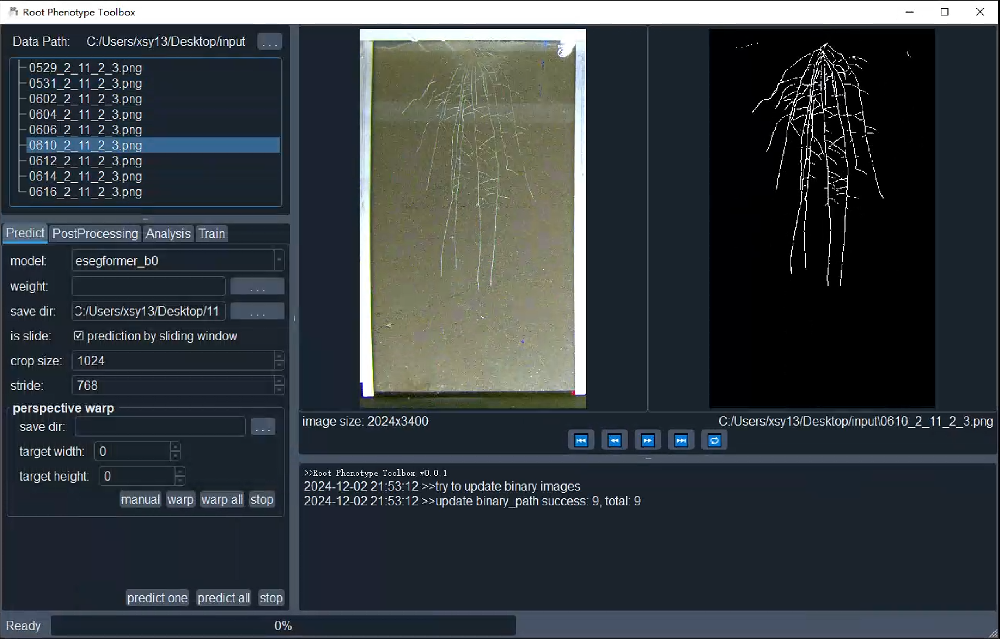

# RPT
RPT software is dedicated to root system segmentation, root system inpainting, and root trait extraction

The weights file for esegformer b2 is available for download at
https://drive.google.com/file/d/1t_vhK3N35MYI-B-X_FGeD89jWiK3OIEW/view?usp=sharing



# Installation Guide

Before using the RPT software, please ensure your system meets the following requirements:

## 1. System Requirements

- Operating System: Windows 10/11 or Linux
- Python Version: 3.7-3.9
- GPU Requirement: NVIDIA GPU with 8GB+ memory

## 2. CUDA and CUDNN Installation

- Download and install CUDA 11.2
- Install corresponding CUDNN version (compatible with CUDA)
- Configure environment variables:
    
    ```bash
    # Windows Environment Variables
    PATH=C:\Program Files\NVIDIA GPU Computing Toolkit\CUDA\v11.2\bin
    PATH=C:\Program Files\NVIDIA GPU Computing Toolkit\CUDA\v11.2\libnvvp
    PATH=C:\Program Files\NVIDIA GPU Computing Toolkit\CUDA\v11.2\include
    ```
    

## 3. PaddlePaddle Installation

Install PaddlePaddle using the following command:

```bash
python -m pip install paddlepaddle-gpu==2.4.1
```

Verify installation:

```python
import paddle
paddle.utils.run_check()
```

## 4. Dependencies Installation

Clone the project and install required dependencies:

```bash
git clone https://github.com/shijiawei124/RPT.git
cd RPT
pip install -r requirements.txt
```

# Detailed Features

## 1. Root System Segmentation (Predict)

Implements intelligent root system segmentation using deep learning:

- Supports multiple image formats (jpg, png, tif, etc.)
- Batch processing capability
- Adjustable segmentation parameters

## 2. Postprocessing

Root System Cleaning:

- Automatic noise removal from segmentation results
- Edge smoothing processing

Root System Inpainting:

- Automatic detection and repair of disconnected roots using GAN
- Interactive manual repair functionality
- Batch processing support

## 3. Root Trait Analysis

Provides extraction and analysis of key root traits:

- Analysis report export (CSV format)

## 4. Model Training

Supports custom training:

- Data preprocessing tools
- Transfer learning support
- Configurable training parameters
- Training process visualization

## Project Repository

For detailed code and documentation, visit: [https://github.com/shijiawei124/RPT.git](https://github.com/shijiawei124/RPT.git)

有啥问题直接邮箱问我呗 506437858@qq.com 我感觉还是有些bug，到时候我来修改下，对了我们训练了很多奇怪的权重，包括水培以及其他根盒背景的，有需要也可以问我

## Feedback

For any issues or suggestions, please:

- Submit an issue on the GitHub project page
- Send an email to the project maintainer
